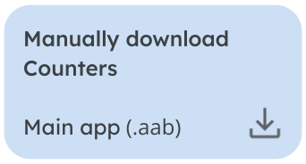
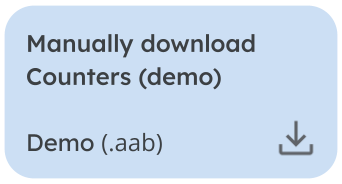

    <h1><b>Counters (Material You)</b></h1>
    
    
TODO: description

More download options

• &nbsp; <a href="" target="_blank">Download Counters Catalog</a>

Issue board & tasks
====

<TODO: link to issue board>

 

Issues / tasks are all categorized using the following labels:

- **Priorities:** ~P0 ~P1 ~P2 ~P3 ~P4 
- **Progress:** ~Planned ~Doing ~"A/B" ~Clean
- **A/B progress:** ~Pending ~"10%" ~"25%" ~"50%"
- **Type:** ~Release ~documentation ~enhancement ~refactor ~support
- **Bugs:** ~bug ~confirmed &nbsp; (confirmed means the bug is replicable)
- **Blocked:** ~BLOCKED &nbsp; (issue that is being blocked by another one)

Progress labels are used as categories on the [issue board](https://url.rahmouni.dev/5SDw).

Priorities follow the [Google Issue Tracker issue priorities](https://developers.google.com/issue-tracker/concepts/issues#priority) guidelines:

| Priority | Description |
| ------ | ------ |
| ~P0 | An issue that needs to be addressed immediately and with as many resources as is required. Such an issue causes a full outage or makes a critical function of the product to be unavailable for everyone, without any known workaround. |
| ~P1 | An issue that needs to be addressed quickly. Such an issue significantly impacts a large percentage of users; if there is a workaround it is partial or overly painful. The impact of the issue is to a core organizational function, or fundamentally impedes another team. |
| ~P2 | An issue that needs to be addressed on a reasonable timescale. Such an issue could be any of the following:  ・ An issue that would be ~P0 or ~P1 but has a reasonable workaround ・ An issue that is important to a large percentage of users and is connected to core organizational functions ・ An issue that is an impediment to the work of other teams and has no reasonable workaround.|
| ~P3 | An issue that should be addressed when able. Such an issue is relevant to core organizational functions or the work of other teams, but does not impede progress or else has a reasonable workaround. |
| ~P4 | An issue that should be addressed eventually. Such an issue is not relevant to core organizational functions or the work of other teams, or else it relates only to the attractiveness or pleasantness of the system. |

Moreover, issues / tasks are categorized using labels representing what app modules the issue touches: 
~"core/auth" ~"core/common" ~"core/config" ~"core/data" ~"core/designsystem" ~"core/feedback" ~"core/ui" 
~"feature/aboutme" ~"feature/dashboard" ~"feature/login" ~"feature/settings"

App dependency graph
====

Contributors
====

• Neïl Rahmouni @neil3000  
• Aurélien Coppée @Laizo

