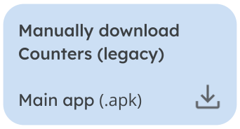

    <h1><b>Counters (Material You)</b></h1>
    
    
Create simple counters to track your habits, progress, workout or medication

<b>More download options</b>

 

About the app
====
**Counters** is an Android app made using **Kotlin & Jetpack Compose**.

The app is a **multimodule app** _(more on that in the [Modules section](#modules))_ which handles **depency injection using Hilt and Dagger**.

The app mostly tries to follow **clean architecture & MVMM principles**, with the multimodule aspect in mind too.

Backend uses **Firebase and Google Cloud (GCP)**, including Authentication, Firestore Database, Cloud Functions, Firebase Hosting, Cloud Storage, A/B Testing, Crashlytics, ~~Dynamic Links~~ _(not anymore, uses Cloud Functions instead)_, Firebase Performance Monitoring, Remote Config and Analytics.

This repository also contains the code of the **Cloud Functions** that we use with this project _(more on that in the [Cloud Functions section](#cloud-functions))_, notably a Cloud Function-based URL shortener and a system that automatically creates Gitlab issues & sends alerts on our Discord when Firebase Crashlytics raises an issue.

The images & videos used in the changelog as well as this readme are made using **Python and Manim** _(more on that in the [Manim section](#manim))_.

Table of contents
====
[TOC]

Issue board & tasks
====

<TODO: link to issue board>

 

Issues / tasks are all categorized using the following labels:

- **Priorities:** ~P0 ~P1 ~P2 ~P3 ~P4 
- **Progress:** ~Planned ~Doing ~"A/B" ~Clean
- **A/B progress:** ~Pending ~"10%" ~"25%" ~"50%"
- **Type:** ~Release ~documentation ~enhancement ~refactor ~support
- **Bugs:** ~bug ~confirmed &nbsp; (confirmed means the bug is replicable)
- **Blocked:** ~BLOCKED &nbsp; (issue that is being blocked by another one)

Progress labels are used as categories on the [issue board](https://url.rahmouni.dev/5SDw).

Priorities follow the [Google Issue Tracker issue priorities](https://developers.google.com/issue-tracker/concepts/issues#priority) guidelines:

| Priority | Description |
| ------ | ------ |
| ~P0 | An issue that needs to be addressed immediately and with as many resources as is required. Such an issue causes a full outage or makes a critical function of the product to be unavailable for everyone, without any known workaround. |
| ~P1 | An issue that needs to be addressed quickly. Such an issue significantly impacts a large percentage of users; if there is a workaround it is partial or overly painful. The impact of the issue is to a core organizational function, or fundamentally impedes another team. |
| ~P2 | An issue that needs to be addressed on a reasonable timescale. Such an issue could be any of the following:  ・ An issue that would be ~P0 or ~P1 but has a reasonable workaround ・ An issue that is important to a large percentage of users and is connected to core organizational functions ・ An issue that is an impediment to the work of other teams and has no reasonable workaround.|
| ~P3 | An issue that should be addressed when able. Such an issue is relevant to core organizational functions or the work of other teams, but does not impede progress or else has a reasonable workaround. |
| ~P4 | An issue that should be addressed eventually. Such an issue is not relevant to core organizational functions or the work of other teams, or else it relates only to the attractiveness or pleasantness of the system. |

Moreover, issues / tasks are categorized using labels representing what app modules the issue touches: 
~"core/auth" ~"core/common" ~"core/config" ~"core/data" ~"core/designsystem" ~"core/feedback" ~"core/ui" 
~"feature/aboutme" ~"feature/dashboard" ~"feature/login" ~"feature/settings"

Modules
====
<TODO: explanation of the different modules with their labels and gitlab folder>

<TODO: explanation of dependency graphs being generated for each module and "here is dependency graph for the whole app":>

Cloud functions
====
<TODO: explanation of the different functions and their role>

Manim
====
This project utilizes Python and the animation library Manim to generate all the visual content you see in this README, our documentation, changelogs, and demo materials.

These include images and videos that showcase the app's features and functionality, to try to keep a similar visual design & consistency between releases & changelogs posts.

The entire Python codebase responsible for generating these visuals can be found within the [manim folder of this project](/manim).

Contributors
====

• Neïl Rahmouni @neil3000  
• Aurélien Coppée @Laizo  
 
